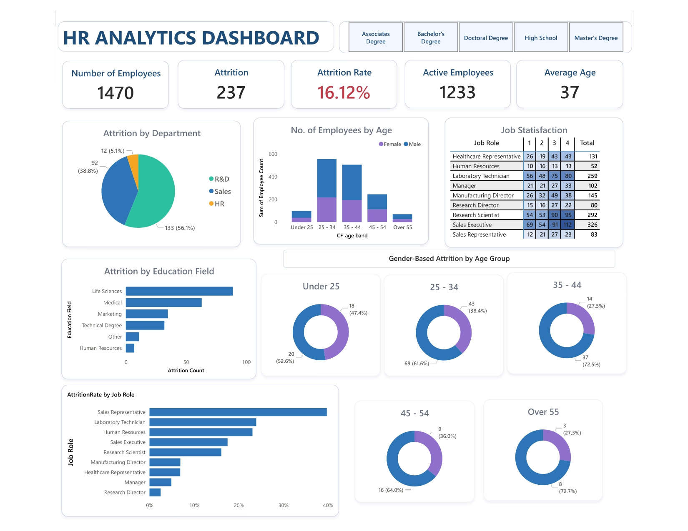

#  HR ANALYTICS DASHBOARD

An interactive and visually optimized Power BI dashboard designed to analyze employee demographics, attrition patterns, job satisfaction, and workforce distribution. This report helps organizations make informed decisions regarding retention, hiring, engagement, and workforce planning.

## Purpose
The HR Analytics Dashboard provides a clear, data-driven view of workforce behavior, enabling HR leaders to:
- Identify attrition drivers
- Understand employee demographic patterns
- Evaluate job satisfaction across roles
- Support evidence-based decisions in recruitment, retention, and talent management

It is designed to unify scattered HR information into one meaningful and actionable analytical view.

##  Tech Stack
- Power BI Desktop – Dashboard development & visualization
- Power Query – Data cleaning and transformation
- DAX (Data Analysis Expressions) – Measures for KPIs, attrition calculations, and custom logic
- Data Modeling – Relationships enabling accurate cross-filtering
- Excel (.xlsx) – Source dataset

##  Data Source
### HR Data.xlsx
An employee-level HR dataset containing fields such as:
- Age
- Gender
- Education Field
- Job Role
- Department
- Attrition Status
- Monthly Income
- Job Satisfaction
- Environment Satisfaction
- Work-Life Balance
- Years at Company

This data enables in-depth workforce and attrition analysis.

##  Features
###  Business Problem
Organizations often struggle to understand the root causes of:
- Employee attrition
- Workforce imbalance
- Engagement gaps

These challenges arise due to the lack of unified, visual, and interactive HR analytics systems.

###  Goal of the Dashboard
- Monitor and analyze attrition trends
- Understand workforce demographics
- Compare job satisfaction across job roles
- Support strategic decisions in workforce planning, retention, and employee development

###  Key Visuals Overview
- KPI Cards – Total Employees, Attrition Count, Attrition Rate, Average Age, Average Salary
- Gender & Age Band Distribution – Donut charts showing gender breakdown across age groups
- Attrition by Department – Pie chart highlighting turnover across R&D, Sales, and HR
- Education Field Breakdown – Bar chart showing employee distribution across education categories
- Job Role Distribution – Visual comparison of employee counts by job role
- Job Satisfaction Matrix – Table showing satisfaction levels across roles

## Business Impact & Insights
- Identified departments and job roles with higher attrition
- Highlighted demographic trends for better hiring and workforce planning
- Surface dissatisfaction patterns to improve employee engagement
- Enabled HR teams to make decisions based on consolidated, real-time analysis

##  Dashboard Preview

